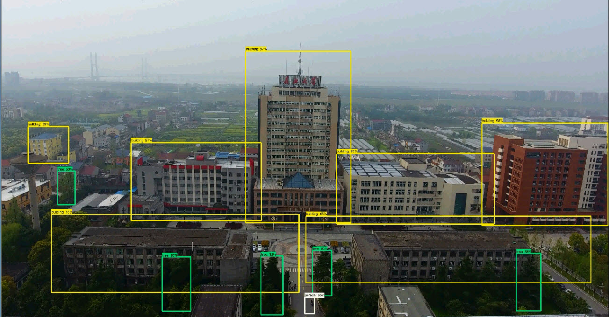

# The Research on Object detection from the video taken by drone via Convolutional neural network (CNN)
The aim of this research is to show the implementation of object detection on drone videos using TensorFlow object detection API [12]. The functional problem of the research is the identification of people, trees, cars and buildings from the real-world video frames taken by drones. In this work, we have done multiple experiments to solve our functional problem and compare state of art Convolutional Object Detection systems (such as SSD [5] and Faster R-CNN [11]) with GoogleNet/Inception base feature extractor. Unmanned Aerial Vehicles (UAVs) or drones are very active area of research and object detection is a key part in achieving full autonomy of any robot. We explored how state-of-the-art object detection algorithms perform on image data from a drone.

  

Setup:

  * <a href='g3doc/installation.md'>Installation</a> 
  * <a href='g3doc/configuring_jobs.md'>
      Configuring an object detection pipeline</a> 
  * <a href='g3doc/preparing_inputs.md'>Preparing inputs</a> 

Running:

  * <a href='g3doc/running_locally.md'>Running locally</a> 
  * <a href='g3doc/running_on_cloud.md'>Running on the cloud</a> 

Extras:

  * <a href='g3doc/detection_model_zoo.md'>Tensorflow detection model zoo</a> 
  * <a href='g3doc/exporting_models.md'>
      Exporting a trained model for inference</a> 
  * <a href='g3doc/defining_your_own_model.md'>
      Defining your own model architecture</a> 
  * <a href='g3doc/using_your_own_dataset.md'>
      Bringing in your own dataset</a> 
  * <a href='g3doc/evaluation_protocols.md'>
      Supported object detection evaluation protocols</a> 
  * <a href='g3doc/oid_inference_and_evaluation.md'>
      Inference and evaluation on the Open Images dataset</a> 
  * <a href='g3doc/instance_segmentation.md'>
      Run an instance segmentation model

## Getting Help

To get help with issues you may encounter using the Tensorflow Object Detection
API, create a new question on [StackOverflow](https://stackoverflow.com/) with
the tags "tensorflow" and "object-detection".

